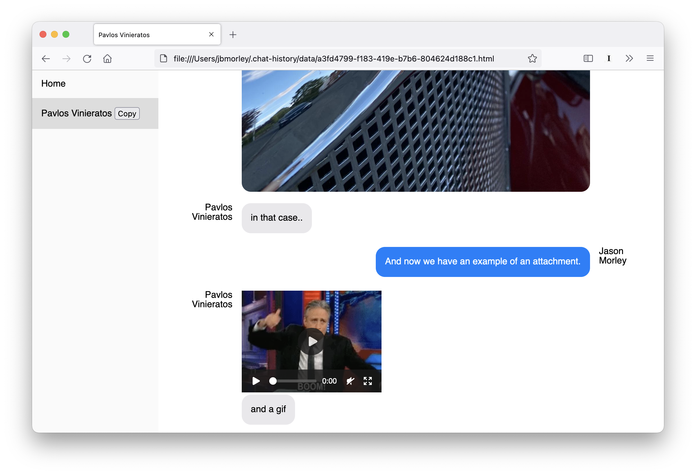

# Chat History

Import chat histories in multiple formats and generate searchable output



## Installation

```bash
git clone git@github.com:jbmorley/chat-history.git
cd chat-history
pipenv install
```

## Usage

```bash
chat-history config.yaml
```

The script generates output in `~/.chat-history`. Right now, it creates pre-rendered HTML files; one for each conversation, and a top-level `index.html` which includes a list of conversations to make it easy to select different conversations. In the future, we hope to output processed messages to an intermediate database and use a React app for viewing conversations.

### Configuration

Chat History currently uses a YAML configuration file to describe the location of all the backups to import, their formats, and known identities (for threading conversations across different protocols). In the future I'd like to make much of this automatic (or configurable via a GUI) to make the tool more accessible, but this helps get things started.

Example configuration:

```yaml
sources:
  - path: "WhatsApp/2021-01-14 WhatsApp iOS Export/*.zip"
    format: "whatsapp_ios"
  - path: "MSN Messenger/*.xml"
    format: "msn_messenger"
  - path: "Chat Logs/**/*.txt"
    format: "text_archive"
  - path: "iChat/2013-08-31 iChats/2007-11-18/*.ichat"
    format: "ichat"
  ...

people:

  - name: Jason Morley
    primary: true
    identities:
      - Jason Morley
      - inertia_jbm@hotmail.com
      - Inertia

  ...
```

The following formats can be used:

- `whatsapp_ios`

  WhatsApp messages in compressed folders as exported from iOS

- `received_files`

  Import a structured folder of attachments that have been received independently of a conversation. Expects one directory per person containing all received attachments from that person.

## Database

The long-term goal is to import messages into an SQLite database and provide a React-based frontend for viewing the database. So far we don't provide a database viewer, so you will need to use SQLite directly.

For example,

- list all people:

  ```sqlite
  select * from people;
  ```

- list all conversations:

  ```sqlite
  select * from conversations;
  ```

- list the events in a conversation:

  ```sqlite
  select * from events where conversation = '8a404813-7ec1-4e73-9300-2138814e34fc';
  ```

- list the messages in a conversation by person:

  ```sqlite
  select people.name, json_extract(content, '$.content')
    from events
    join people on events.person = people.id
   where conversation = '8a404813-7ec1-4e73-9300-2138814e34fc' and type = 'message';
  ```

- search for messages matching a string:

  ```sqlite
  select json_extract(content, '$.content') from events where type='message' and content LIKE '%jonty%';
  ```

The schema is very much a work-in-progress and is likely to change as we identify specific needs for the React app.
